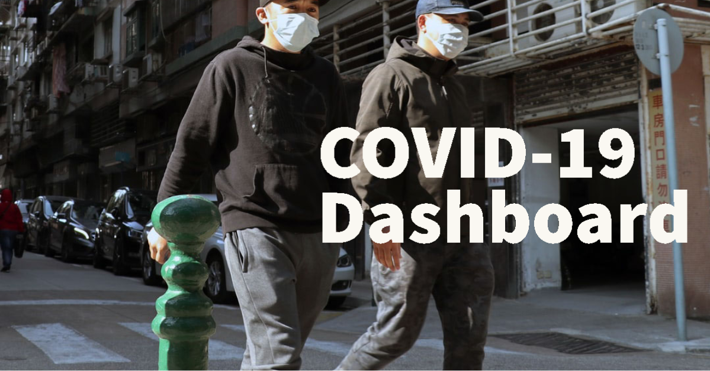

# Covid-19 Dashboard



This is the monitoring and analytics reporting dashboard for COVID-19, to help citizens get to know about realtime situations of the pandemic outbreak.

## Installation

- Install all the dependencies
```bash
$ yarn
$ cd server && yarn
``` 
- Run the frontend
```bash
$ yarn run dev
```
- Run the backend
```bash
$ cd server
$ yarn run dev
```
## Deployment

- [Zeit Now](https://zeit.co) - This platform is recommended to host the frontend of the project as it automatically optimises and scales the app for performance.
- [Heroku](https://heroku.com) - This platform is recommended to host the backend of the project as due to its native CI builtin and you can also spin up free docker containers.